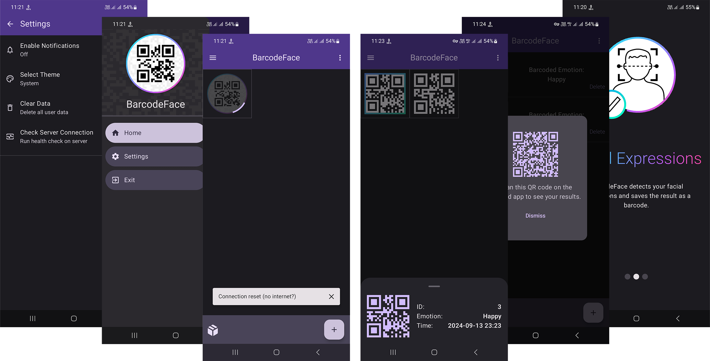

# BarcodeFace

BarcodeFace is a native Android application made for my bachelor's degree's final project.  
It is a facial expression information management application aimed for use in psychological counseling.

## Overview

This project focuses on the design and implementation of a mobile application aimed at managing users' facial expressions for use in psychological counseling.  
The application is designed to enhance the counseling process by capturing the user's facial expressions at specified times and processing the collected data using artificial intelligence solutions. A feature of this system is the conversion of facial data into barcode structures, which not only simplifies data transfer but also protects user privacy.  
Psychologists can access this data temporarily through barcode scanning without the need to store sensitive client information.

## Implementation

The project emphasizes effective implementation using modern Android technologies and clean architecture.  
The application is made entirely with Kotlin and Jetpack Compose and follows the MVVM architecture pattern.  
Material Design 3 is used to create a modern and engaging user interface.

## Screenshots

